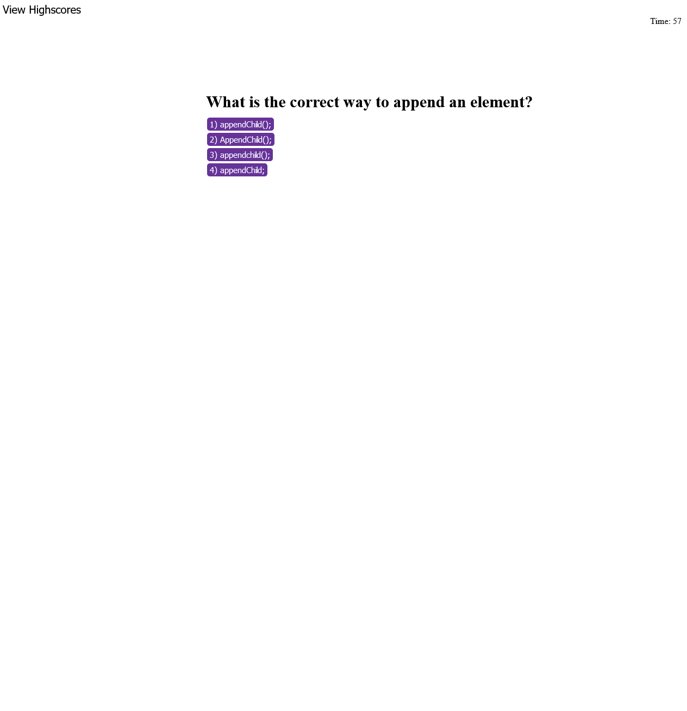

# Coding Quiz

## Description
This is a web application made from JavaScript, HTML and CSS that starts a quiz based on 5 JavaScript questions. It sets a timer up at 60 seconds and wrong answers penalize the user by
10 seconds. The time left when all 5 questions are answered is the user's score. Score's are saved into localstorage and organized by greatest to least on the highscores page.

https://maxkottong.github.io/Coding-Quiz/ -- This is the deploy link